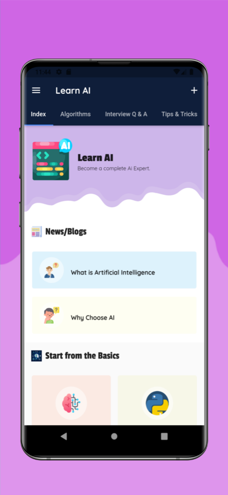
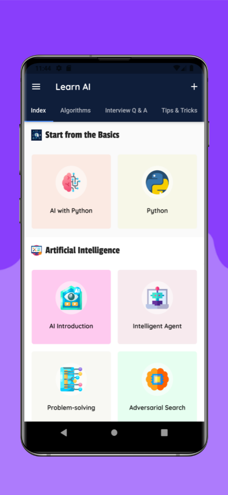
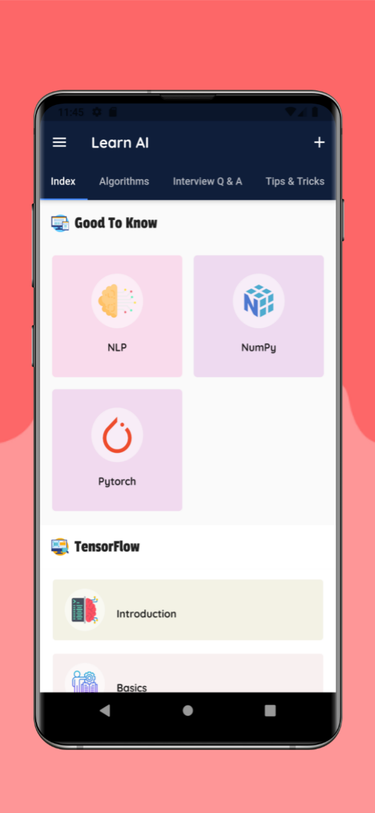
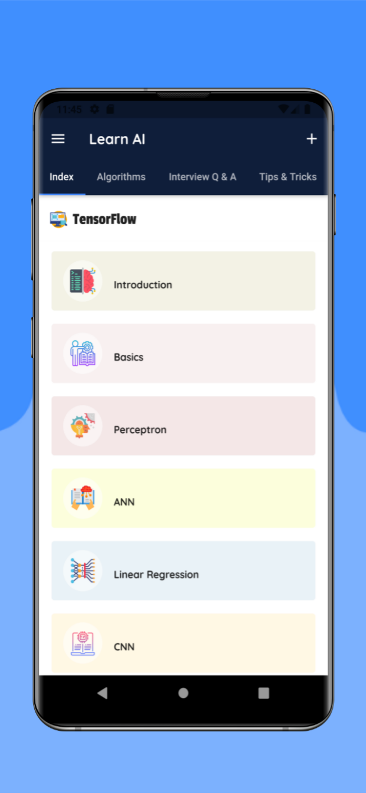
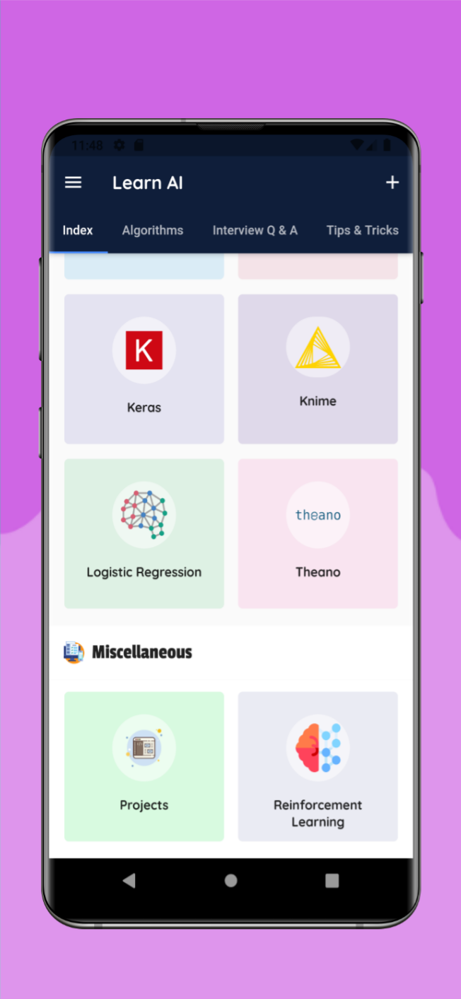

# Learn Artificial Intelligence

## Table Of Contents

<!-- TOC -->

- [Learn Artificial Intelligence](#learn-artificial-intelligence)
    - [Table Of Contents](#table-of-contents)
    - [Information Collection And Use](#information-collection-and-use)
    - [Types of Data Collected](#types-of-data-collected)
        - [Personal Data](#personal-data)
    - [Cookies and Usage Data](#cookies-and-usage-data)
        - [Usage Data](#usage-data)
        - [Tracking & Cookies Data](#tracking--cookies-data)
        - [Cookies are files with small amount of data which may include an anonymous unique identifier.](#cookies-are-files-with-small-amount-of-data-which-may-include-an-anonymous-unique-identifier)
        - [Disclosure Of Data Legal Requirements](#disclosure-of-data-legal-requirements)
        - [Service Providers](#service-providers)
        - [Links To Other Sites](#links-to-other-sites)
    - [Tutorial](#tutorial)
    - [Screenshots](#screenshots)

<!-- /TOC -->

## Information Collection And Use

We collect several different types of information for various purposes to provide and improve our Service to you.

## Types of Data Collected

### Personal Data

While using our Service, we may ask you to provide us with certain personally identifiable information that can be used to contact or identify you ("Personal Data").
 Personally identifiable information may include, but is not limited to:

## Cookies and Usage Data 

### Usage Data

When you access the Service by or through a mobile device, we may collect certain information automatically, including, but not limited to, the type of mobile device you use, your mobile device unique ID, the IP address of your mobile device, your mobile operating system, the type of mobile Internet browser you use, unique device identifiers and other diagnostic data ("Usage Data").

### Tracking & Cookies Data

We use cookies and similar tracking technologies to track the activity on our Service and hold certain information.

### Cookies are files with small amount of data which may include an anonymous unique identifier. 

Cookies are sent to your browser from a website and stored on your device. Tracking technologies also used are beacons, tags, and scripts to collect and track information and to improve and analyze our Service.

You can instruct your browser to refuse all cookies or to indicate when a cookie is being sent. However, if you do not accept cookies, you may not be able to use some portions of our Service.

Use of Data
Learn Artificial Intelligence uses the collected data for various purposes:

To provide and maintain the Service
To notify you about changes to our Service
To allow you to participate in interactive features of our Service when you choose to do so
To provide customer care and support
To provide analysis or valuable information so that we can improve the Service
To monitor the usage of the Service
To detect, prevent and address technical issues
Transfer Of Data
Your information, including Personal Data, may be transferred to — and maintained on — computers located outside of your state, province, country or other governmental jurisdiction where the data protection laws may differ than those from your jurisdiction.

Learn Artificial Intelligence will take all steps reasonably necessary to ensure that your data is treated securely and in accordance with this Privacy Policy and no transfer of your Personal Data will take place to an organization or a country unless there are adequate controls in place including the security of your data and other personal information.

### Disclosure Of Data Legal Requirements

Learn Artificial Intelligence may disclose your Personal Data in the good faith belief that such action is necessary to:

To comply with a legal obligation
To protect and defend the rights or property of Learn Artificial Intelligence
To prevent or investigate possible wrongdoing in connection with the Service
To protect the personal safety of users of the Service or the public
To protect against legal liability
Security Of Data
The security of your data is important to us, but remember that no method of transmission over the Internet, or method of electronic storage is 100% secure. While we strive to use commercially acceptable means to protect your Personal Data, we cannot guarantee its absolute security.

### Service Providers

We may employ third party companies and individuals to facilitate our Service ("Service Providers"), to provide the Service on our behalf, to perform Service-related services or to assist us in analyzing how our Service is used.

These third parties have access to your Personal Data only to perform these tasks on our behalf and are obligated not to disclose or use it for any other purpose.

### Links To Other Sites

Our Service may contain links to other sites that are not operated by us. If you click on a third party link, you will be directed to that third party's site. We strongly advise you to review the Privacy Policy of every site you visit.

## Tutorial 

dwad

## Screenshots

- 
- 
- 
- 
- 
- 
- 
